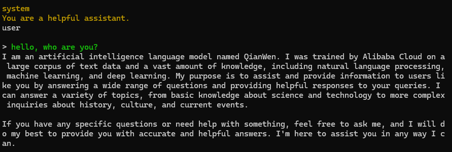

# 泰山派嵌入式大模型

## 简介

在 泰山派 上尝试使用 [llama.cpp](https://github.com/ggerganov/llama.cpp) 离线部署 [Qwen1.5-1.8b](https://huggingface.co/Qwen/Qwen1.5-1.8B-Chat-GGUF) 大模型，基于 `OpenBLAS` + `CLBlast` 加速, 提供了编译好的二进制文件

## 使用说明

### 0. 系统

- `ubuntu20.04_hdmi_20231130_update.img`

### 1. 安装

```shell
git clone https://github.com/guidons-master/tspi-LLM.git

cd tspi-LLM

source install.sh
```

### 2. 模型

手动下载 [Qwen1.5-1.8B-Chat-GGUF](https://modelscope.cn/api/v1/models/qwen/Qwen1.5-1.8B-Chat-GGUF/repo?Revision=master&FilePath=qwen1_5-1_8b-chat-q3_k_m.gguf) 模型文件，将 `qwen1_5-1_8b-chat-q3_k_m.gguf` 文件移动到 `llm` 目录下

### 3. 运行

交互式对话

```shell
llm-main -m llm/qwen1_5-1_8b-chat-q3_k_m.gguf -n 512 --color -i -cml -f llm/qwen.txt
```

`OpenAI API` 服务器

```shell
llm-server -m llm/qwen1_5-1_8b-chat-q3_k_m.gguf -c 2048 --host 0.0.0.0 --port 8080
```

### 4. 效果

